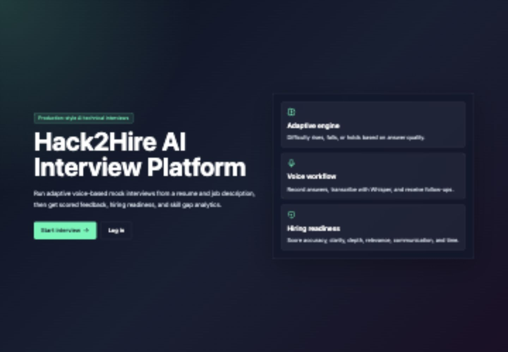
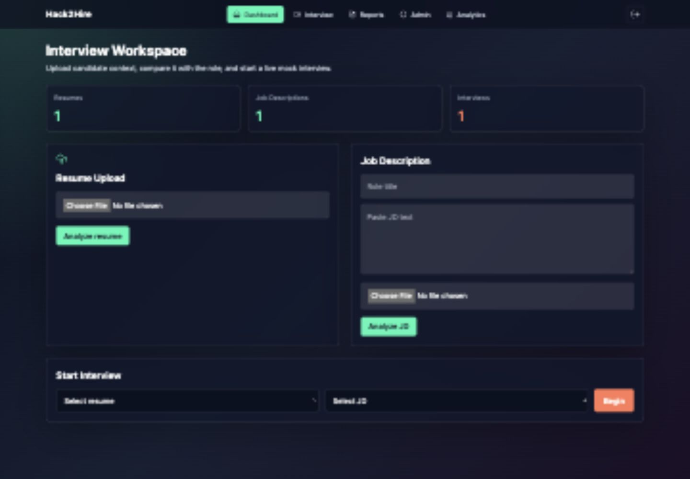
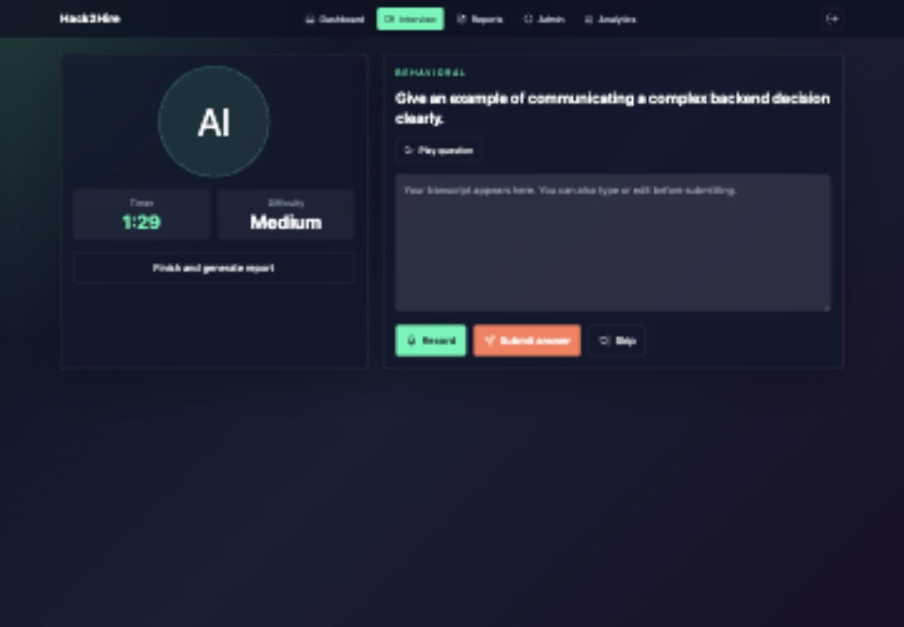
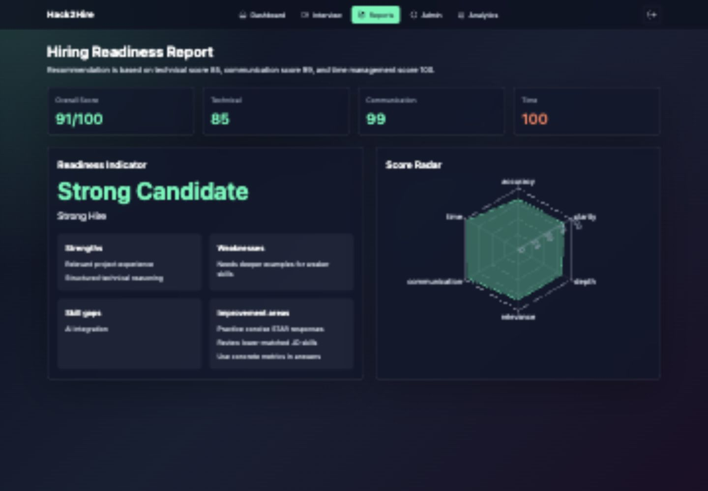
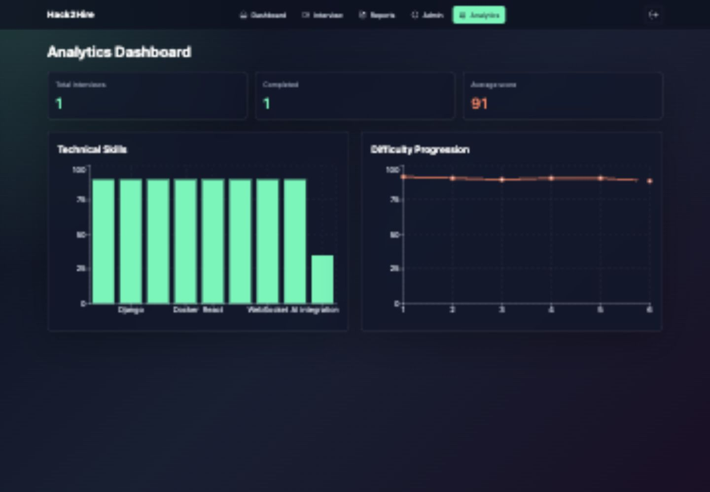
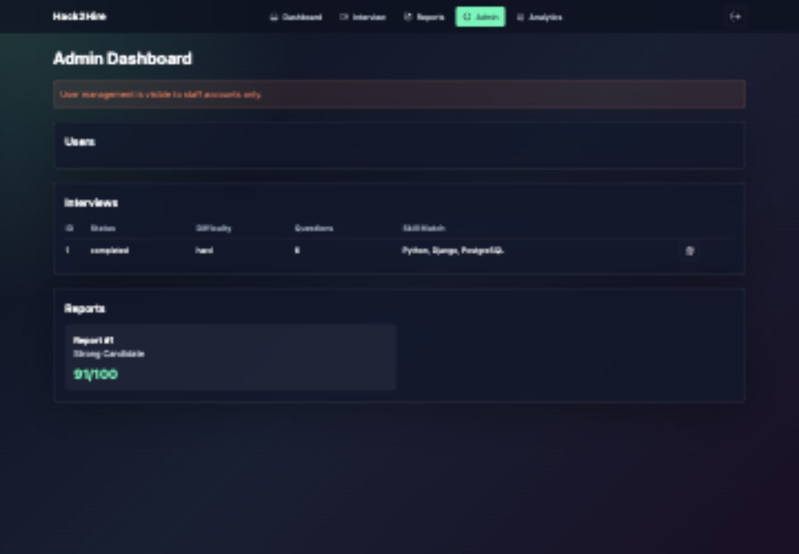

# Hack2Hire AI Interview Platform

Hack2Hire is a full-stack, voice-based AI mock interview platform for technical hiring readiness. It analyzes a resume and job description, generates adaptive interview questions, scores answers across hiring metrics, and produces a final readiness report with analytics.

## Demo Credentials

Seeded by `python manage.py seed_demo`:

- Candidate: `demo` / `DemoPass123!`
- Admin: `admin` / `AdminPass123!`

## Screenshots








## Features

- Signup, login, JWT auth, and protected React routes.
- Resume upload from PDF or text with skill, project, education, and experience extraction.
- Job description text or file upload with skill and experience extraction.
- Resume-vs-JD skill matching matrix.
- Adaptive interview generation using resume, JD, and skill gaps.
- Voice answer recording, audio upload, Whisper transcription hook, and editable transcript.
- Answer evaluation across accuracy, clarity, depth, relevance, communication, and time efficiency.
- Adaptive difficulty engine with early termination threshold.
- Communication analysis for filler words, repeated words, and pause markers.
- Final hiring readiness report with radar chart and recommendation.
- Analytics dashboard for skills, score history, and difficulty progression.
- Staff-only admin user view plus interview/report management.
- Dockerized backend, frontend, and PostgreSQL services.
- Demo seed command with sample resume, sample JD, interview, scores, and report.

## Architecture

```text
React + TypeScript + Tailwind
        |
        | REST + JWT
        v
Django REST Framework API  ---- WebSocket ---- Interview room events
        |
        v
PostgreSQL
        |
        v
OpenAI GPT-4o / Whisper / TTS
```

## Tech Stack

Frontend: React, TypeScript, TailwindCSS, React Router, Recharts, WebSocket API.

Backend: Django, Django REST Framework, SimpleJWT, Channels, PostgreSQL.

AI: OpenAI GPT-4o for extraction/evaluation, Whisper for transcription, OpenAI TTS for question playback.

Deployment: Docker, Docker Compose, Nginx, Daphne.

## Installation From A Fresh Machine

```bash
git clone https://github.com/mahima-nandy/hack2hire.git
cd hack2hire
cp backend/.env.example backend/.env
```

Edit `backend/.env` and set `OPENAI_API_KEY` for full AI, speech-to-text, and text-to-speech functionality.

Run with Docker:

```bash
docker compose up --build
```

In another terminal, seed demo data:

```bash
docker compose exec backend python manage.py seed_demo
```

Open:

```text
Frontend: http://localhost:3000
Backend API: http://localhost:8000/api
Django Admin: http://localhost:8000/admin
```

Local development without Docker:

```bash
cd backend
python -m venv .venv
. .venv/bin/activate
pip install -r requirements.txt
USE_SQLITE=1 DJANGO_DEBUG=1 python manage.py migrate
USE_SQLITE=1 DJANGO_DEBUG=1 python manage.py seed_demo
USE_SQLITE=1 DJANGO_DEBUG=1 python manage.py runserver
```

```bash
cd frontend
npm install
npm run dev
```

Run checks:

```bash
cd backend
USE_SQLITE=1 python manage.py test interviews
USE_SQLITE=1 python manage.py check
```

```bash
cd frontend
npm test
npm run build
```

## API Endpoints

Authentication:

- `POST /api/auth/signup/`
- `POST /api/auth/login/`
- `POST /api/auth/refresh/`

Resume and job description:

- `GET /api/resumes/`
- `POST /api/resumes/`
- `GET /api/job-descriptions/`
- `POST /api/job-descriptions/`

Interview:

- `GET /api/sessions/`
- `POST /api/sessions/`
- `GET /api/sessions/{id}/`
- `DELETE /api/sessions/{id}/`
- `POST /api/sessions/{id}/next_question/`
- `POST /api/sessions/{id}/speak/`
- `POST /api/sessions/{id}/finish/`
- `POST /api/answers/`

Reports and analytics:

- `GET /api/reports/`
- `GET /api/reports/{id}/`
- `GET /api/analytics/summary/`
- `GET /api/admin/users/` staff only

Realtime:

- `ws://localhost:8000/ws/interviews/{session_id}/`

## Demo Walkthrough

1. Log in as `demo`.
2. Review the seeded resume, JD, and interview count on the dashboard.
3. Start a new interview from the seeded resume and JD, or open the seeded interview from `/interview/1`.
4. Record or type an answer, submit it, and watch the platform score the response.
5. Finish the session to generate a hiring readiness report.
6. Open Analytics to view skill matching and difficulty progression.
7. Log in as `admin` to view users, interviews, and reports.

Sample files:

- [Sample Resume](outputs/sample_resume.txt)
- [Sample JD](outputs/sample_jd.txt)

## Implementation Status

Working without an OpenAI key:

- Auth, dashboard, uploads, fallback text extraction, fallback skill extraction, fallback question generation, fallback answer scoring, reports, analytics, admin page, demo seed data, Docker wiring.

Requires `OPENAI_API_KEY`:

- GPT-4o resume/JD analysis.
- GPT-4o adaptive question and follow-up quality beyond deterministic fallback.
- GPT-4o answer evaluation and feedback quality beyond deterministic fallback.
- Whisper speech-to-text transcription from uploaded audio.
- OpenAI text-to-speech question playback.

## Environment Variables

Backend:

- `DJANGO_DEBUG`
- `DJANGO_SECRET_KEY`
- `DJANGO_ALLOWED_HOSTS`
- `CORS_ALLOWED_ORIGINS`
- `POSTGRES_DB`
- `POSTGRES_USER`
- `POSTGRES_PASSWORD`
- `POSTGRES_HOST`
- `POSTGRES_PORT`
- `OPENAI_API_KEY`
- `OPENAI_MODEL`
- `OPENAI_STT_MODEL`
- `OPENAI_TTS_MODEL`
- `USE_SQLITE` local development only

Frontend:

- `VITE_API_BASE_URL`
- `VITE_WS_BASE_URL`

## Deployment Notes

The app is Docker-ready. A public deployment can be created by hosting:

- Backend on Render, Railway, Fly.io, or AWS.
- PostgreSQL on the same provider or Supabase/Neon.
- Frontend on Vercel, Netlify, or static Nginx hosting.

Update `CORS_ALLOWED_ORIGINS`, `DJANGO_ALLOWED_HOSTS`, `VITE_API_BASE_URL`, and `VITE_WS_BASE_URL` for the deployed domains.

## Remaining Blockers Before Deployment

- Docker was not available in the Codex environment, so `docker compose up` could not be executed here.
- A real deployed URL is not configured yet.
- Screen recording video is still required for hackathon submission; record the seeded demo flow after deployment or local Docker startup.
- OpenAI-dependent features need a valid `OPENAI_API_KEY` for full AI transcription, TTS, and GPT quality.
- Production should use a stronger `DJANGO_SECRET_KEY`, HTTPS, persistent media storage, and a managed PostgreSQL backup policy.

## Future Scope

- Live streaming transcription during recording.
- Rubric calibration per company or role.
- Multi-round interview packs.
- Recruiter collaboration and shareable report links.
- Video interview analysis.
- Background task queue for long AI jobs.
